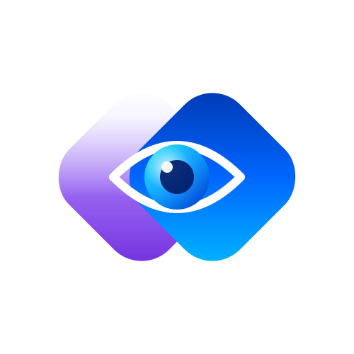

<p align="center">
  
</p>

<h1 align="center">DevDiff</h1>
<p align="center">
  <strong>Your codebase's memory, not just its history.</strong>
</p>

<p align="center">
  <a href="https://github.com/EldrexDelosReyesBula/devdiff/actions">
    
  </a>
  <a href="https://www.npmjs.com/package/@eldrex/cli">
    
  </a>
  <a href="https://opensource.org/licenses/MIT">
    
  </a>
  <a href="https://ko-fi.com/landecsorg/">
    
  </a>
  <a href="https://www.paypal.com/paypalme/eldrexbula">
    
  </a>
</p>

---

## What is DevDiff?

DevDiff watches your code changes and generates **intelligent, human-readable changelogs** using AI that **you control**. It explains _what_ changed and _why_ — not just raw git diffs.

### 🔒 Privacy-First

Runs **100% locally** by default. Your code never leaves your machine.

### 🤖 Bring Your Own AI

Use **Ollama**, **llama.cpp**, **Transformers.js**, **OpenAI**, **Anthropic**, or any provider. Full control.

### ⚡ Token Optimized

Smart diff batching, AST trimming, and caching reduce AI token usage by up to **85%**.

---

## Quick Start

```bash
# Install globally
npm install -g @eldrex/cli

# Initialize in your git repo
cd my-project
npx devdiff init

# That's it! Every commit gets an AI explanation.
git commit -m "add user auth"
# ✨ DevDiff automatically generates changelog...
```

### With Ollama (free, local, offline)

```bash
# Install Ollama
curl -fsSL https://ollama.com/install.sh | sh

# Pull a model
ollama pull llama3.2:3b

# DevDiff auto-detects it!
npx devdiff generate
```

---

## How It Works

```
Your Code Changes
        │
        ▼
┌──────────────────┐
│  Git Diff Parser  │ ← Watches .git for changes
└────────┬─────────┘
         │
         ▼
┌──────────────────┐
│  AST Trimmer      │ ← Strips non-essential code
│  Secret Scanner   │ ← Redacts sensitive data
└────────┬─────────┘
         │
         ▼
┌──────────────────┐
│  AI Router        │ ← Picks best provider
│  Batcher          │ ← Optimizes token usage
└────────┬─────────┘
         │
         ▼
┌──────────────────┐
│  Your AI           │ ← Ollama / OpenAI / etc.
└────────┬─────────┘
         │
         ▼
┌──────────────────┐
│  Changelog        │ ← Human-readable markdown
│  Generator        │
└──────────────────┘
```

---

## Features

- 📝 **AI-Powered Changelogs** — What changed and why
- 🔒 **Local-First** — No data leaves your machine
- 🤖 **BYOAI** — Your AI, your rules
- ⚡ **Token Optimized** — Up to 85% less token usage
- 🔌 **Integrations** — VS Code, Vite, GitHub Actions, Linear, Jira
- 📊 **Dashboard** — Beautiful web UI and terminal dashboard
- 🌍 **MIT Licensed** — Free forever

---

## Packages

| Package                                 | Description            | Version                                                                                         |
| --------------------------------------- | ---------------------- | ----------------------------------------------------------------------------------------------- |
| [`@eldrex/core`](/packages/core)        | Core changelog engine  | [](https://www.npmjs.com/package/@eldrex/core) |
| [`@eldrex/cli`](/packages/cli)          | Command-line interface | [](https://www.npmjs.com/package/@eldrex/cli)   |
| [`@eldrex/vite`](/packages/vite-plugin) | Vite plugin            | [](https://www.npmjs.com/package/@eldrex/vite) |
| [`@eldrex/vscode`](/packages/vscode)    | VS Code extension      | [Marketplace](https://marketplace.visualstudio.com/items?itemName=ebula.devdiff)                |

---

---

## 💻 VS Code Extension & Offline Pre-Release

For the VS Code extension, you can install it directly from the marketplace or download the packaged pre-release VSIX file:

- **Download VSIX**: Get the latest release from [GitHub Releases](https://github.com/EldrexDelosReyesBula/devdiff/releases)
- For setup instructions, see the [VS Code Extension README](/packages/vscode/README.md).

---

## 📚 Documentation & Help Guides

- 📖 **Getting Started**: [5-Minute Setup Guide](https://github.com/EldrexDelosReyesBula/devdiff/blob/main/docs/guide/getting-started.md)
- 🤖 **AI Model Setup**: [Ollama Setup Guide](https://github.com/EldrexDelosReyesBula/devdiff/blob/main/docs/ai-providers/ollama-setup.md)
- ❌ **Troubleshooting**: [Ollama Errors & Fixes](https://github.com/EldrexDelosReyesBula/devdiff/blob/main/docs/troubleshooting/ollama-errors.md) | [Windows-Specific Issues](https://github.com/EldrexDelosReyesBula/devdiff/blob/main/docs/troubleshooting/windows-issues.md) | [Quick Fixes Matrix](https://github.com/EldrexDelosReyesBula/devdiff/blob/main/docs/troubleshooting/common-fixes.md)
- 🔒 **Security & Versioning**: [Security Model Policy](https://github.com/EldrexDelosReyesBula/devdiff/blob/main/docs/security/overview.md) | [Immutable Version Strategy](https://github.com/EldrexDelosReyesBula/devdiff/blob/main/docs/versioning/policy.md)
- 📖 **Full Documentation Site**: [devdiff.vercel.app](https://devdiff.vercel.app)

---

## 🤝 Support & Consulting

DevDiff is a community-supported open-source project created and maintained by **Eldrex Delos Reyes Bula**.

If you or your organization finds DevDiff valuable, consider supporting or booking professional consulting services:

- 📧 **Consulting & Priority Support**: [eldrexdelosreyesbula@gmail.com](mailto:eldrexdelosreyesbula@gmail.com)
- ☕ **Ko-fi Donations**: [Sponsor on Ko-fi](https://ko-fi.com/landecsorg/)
- 💳 **PayPal Support**: [Donate via PayPal Me](https://www.paypal.com/paypalme/eldrexbula)
- 📄 **Full Support Channels**: See [SUPPORT.md](/SUPPORT.md)

---

## 👥 Community & Contributing

- 📝 **Discussions**: [GitHub Discussions](https://github.com/EldrexDelosReyesBula/devdiff/discussions)
- 🐛 **Bugs & Features**: [GitHub Issues](https://github.com/EldrexDelosReyesBula/devdiff/issues)
- 🤝 **Contributing**: See [CONTRIBUTING.md](CONTRIBUTING.md) and [CODE_OF_CONDUCT.md](CODE_OF_CONDUCT.md)

---

## 📄 License

[MIT](LICENSE) © Eldrex Delos Reyes Bula and Contributors
