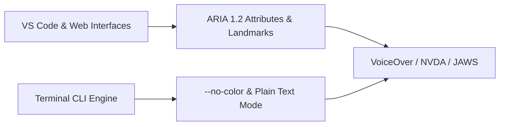

# Screen Reader Compatibility & Assistive Technology

DevDiff is tested for compatibility with major assistive technologies and screen readers, including **VoiceOver** (macOS/iOS), **NVDA** (Windows), **JAWS** (Windows), and **Orca** (Linux).

---

## Assistive Technology Architecture



---

## Key Screen Reader Safeguards

### 1. ARIA Live Regions (`aria-live="polite"`)

Progressive changelog generation status and background index updates emit real-time announcements to screen readers without interrupting active speech.

### 2. Semantic HTML & Landmarks

All views use standard HTML5 semantic elements (`<main>`, `<header>`, `<nav>`, `<aside>`, `<article>`) and WAI-ARIA role attributes (`role="tablist"`, `role="tabpanel"`, `role="log"`).

### 3. Accessible CLI Execution (`--no-color`)

Developers using screen readers in terminal environments can pass `--no-color` or set `NO_COLOR=1` to strip ANSI color escape sequences:

```bash
NO_COLOR=1 devdiff generate
```
