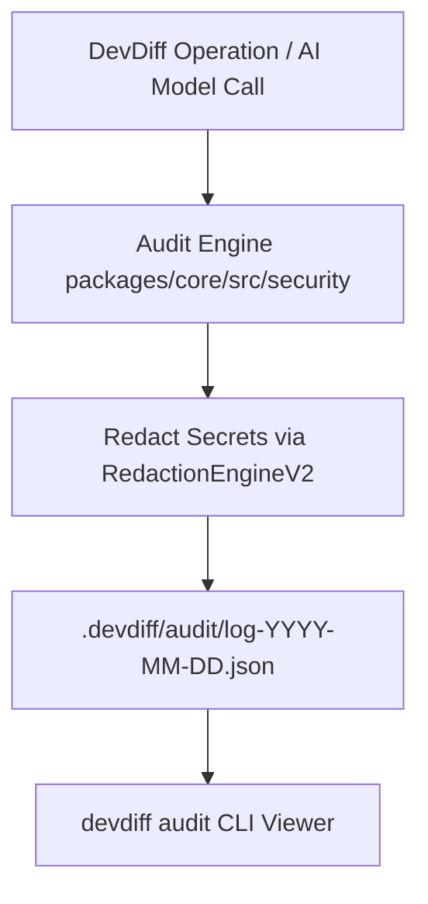

# Compliance Audit Trail & Local Logging Engine

DevDiff (v1.6.0) includes a local **Audit Logging Engine** that maintains transparent, tamper-evident audit logs of all AI model invocations, shell executions, and network socket connections on the local developer workstation.

---

## Audit Architecture & Local Storage



---

## Audit Log Structure & Fields

Every audit entry logged locally to `.devdiff/audit/` contains non-sensitive metadata:

```json
{
  "timestamp": "2026-08-08T22:15:00.000Z",
  "operation": "generate_changelog",
  "provider": "ollama-local",
  "model": "llama3.2:3b",
  "tokens": { "prompt": 1240, "completion": 310 },
  "durationMs": 420,
  "redactedKeysCount": 2,
  "status": "success"
}
```

---

## CLI Audit Commands

### 1. View AI Call Audit Log

```bash
# View recent AI invocation logs
devdiff audit
```

### 2. View Shell & Subprocess Executions

```bash
# View local git & shell commands executed by DevDiff
devdiff audit shell
```

### 3. View Network Connections & Socket Binds

```bash
# View outbound HTTP/HTTPS requests & local socket bindings
devdiff audit network
```

### 4. Export Audit Report for SOC 2 / HIPAA Reviewers

```bash
# Export formatted audit trail to JSON or CSV
devdiff audit export --format json --output audit-report-2026.json
```
