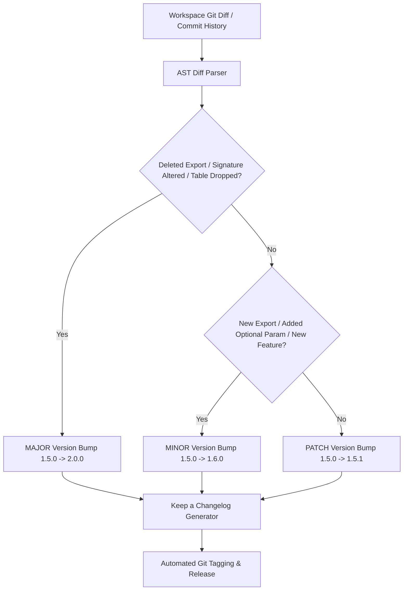

# Automated Versioning & Release System (v1.6.0)

DevDiff **v1.6.0** includes an automated **Versioning & Release Engine** (`SemverDetector` & `ChangelogGenerator`). By analyzing AST modifications, export signatures, schema alterations, and git commit history, DevDiff accurately determines Semantic Versioning (SemVer) increments (`MAJOR`, `MINOR`, `PATCH`) and updates release logs automatically.

---

## AST Versioning Detection Engine



---

## Key Capabilities

- **Automated SemVer Detection**: Analyzes breaking changes (removed exports, signature alterations, dropped SQL tables) $\rightarrow$ `MAJOR`, new features $\rightarrow$ `MINOR`, bug fixes $\rightarrow$ `PATCH`.
- **Keep a Changelog Standard**: Groups changes into standardized sections: `Added`, `Changed`, `Deprecated`, `Removed`, `Fixed`, and `Security`.
- **One-Command Release**: `devdiff release` executes version bumping, `CHANGELOG.md` updates, git tagging, and remote pushing in a single non-blocking step.

---

## CLI Release Commands

```bash
# Auto-detect version bump type and update package.json + CHANGELOG.md + Git tag
devdiff version bump --type auto

# Preview version bump without writing files
devdiff version bump --type auto --dry-run

# Force specific version bump type
devdiff version bump --type patch
devdiff version bump --type minor
devdiff version bump --type major

# One-command full release (Bump + Changelog + Tag + Push)
devdiff release
```
