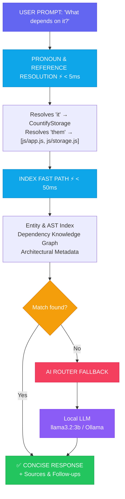

# Conversational Q&A Engine (v1.5.0)

DevDiff **v1.5.0** introduces the **Conversational Q&A Engine** (`ConversationalQA`), providing instant sub-50ms codebase queries with pronoun resolution (`it`, `this`, `that`, `them`, `those`) and multi-turn context memory across session turns.

---

## 🎯 Architecture & Performance



---

## ⚡ Performance Breakdown

| Query Type                                     | Typical Response Time | Data Source          |
| :--------------------------------------------- | :-------------------- | :------------------- |
| **Entity Lookup** (`"What does X do?"`)        | `< 10ms`              | Codebase Index       |
| **Dependency Query** (`"What depends on X?"`)  | `< 15ms`              | Knowledge Graph      |
| **Count Queries** (`"How many functions?"`)    | `< 5ms`               | AST Statistics       |
| **Compliance Checks** (`"Is this GDPR safe?"`) | `< 20ms`              | Privacy Rules Engine |
| **Context Resolution** (`"Tell me about it"`)  | `< 5ms`               | Conversation State   |
| **AI Fallback** (`"Explain complex logic"`)    | `500ms - 2s`          | Ollama / Cloud LLM   |

---

## 💬 Question Patterns & Pronoun Resolution

The Q&A engine dynamically resolves pronouns based on conversation history:

1. **`"What does X do?"`**:
   Looks up `X` in indexed classes, interfaces, components, and functions. Sets `X` as the active topic.

2. **`"What depends on it?"` / `"What about it?"`**:
   Automatically substitutes `"it"` with the active topic (`X`).

3. **`"Where is X?"`**:
   Returns the relative file path and line number location.

4. **`"How many functions / classes / files?"`**:
   Returns exact numeric totals from the indexed codebase snapshot.

5. **`"Is this GDPR / HIPAA compliant?"`**:
   Executes quick compliance checks for hardcoded secrets, unencrypted localStorage usage, and PII patterns.

---

## 💻 CLI Usage & Examples

```bash
# Ask initial question
devdiff ask "What does CountifyStorage do?"

# Output:
# [lucide:message-square] DevDiff Conversational Memory (12ms from index):
# CountifyStorage in `js/storage.js` — IndexedDB wrapper providing async CRUD.
# [lucide:file-text] Sources: `js/storage.js`
# [lucide:lightbulb] Follow up:
#    • "What depends on CountifyStorage?"
#    • "Show me the code"

# Natural follow-up (uses pronoun context):
devdiff ask "What depends on it?"

# Output:
# CountifyStorage is used by 2 files: `js/app.js` and `js/analytics.js`.
```

---

## 🔧 Programmatic API (`@eldrex/core`)

```typescript
import { ConversationalQA } from "@eldrex/core";

const qa = new ConversationalQA(process.cwd());

// Turn 1
const res1 = await qa.ask("What does SkillManager do?");
console.log(res1.answer); // "SkillManager in packages/core/src/skill/skill-manager.ts..."

// Turn 2 (Pronoun resolution)
const res2 = await qa.ask("What depends on it?");
console.log(res2.answer); // "SkillManager is referenced in packages/cli/src/commands/skill.ts..."

// Clear conversation context
qa.reset();
```
