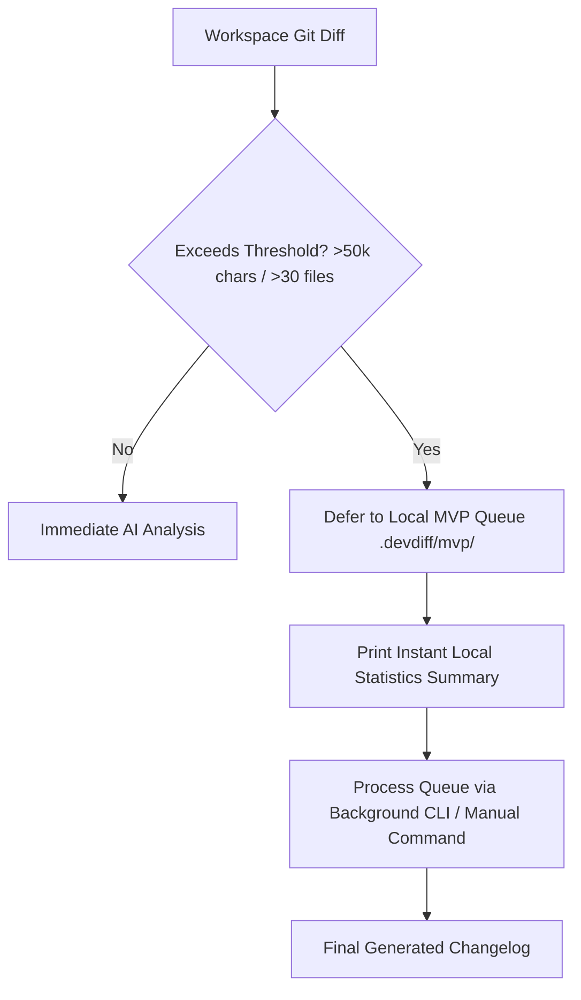

# MVP Mode (Most Valuable Deferral) (v1.6.0)

During high-velocity development sessions or large monorepo refactoring (1,000+ changed files), processing raw diffs through AI models immediately can exceed context windows or consume significant system resources.

DevDiff provides **MVP Mode** (Most Valuable Deferral) — a non-blocking queueing system that saves large diffs locally and processes them asynchronously when system resources are free.

---

## MVP Deferral Flow



---

## CLI Commands

```bash
# View queue status of deferred changelogs
devdiff mvp status

# Process next queued entry
devdiff mvp process

# Process all queued entries
devdiff mvp process-all

# Clear processed entries
devdiff mvp clear
```
