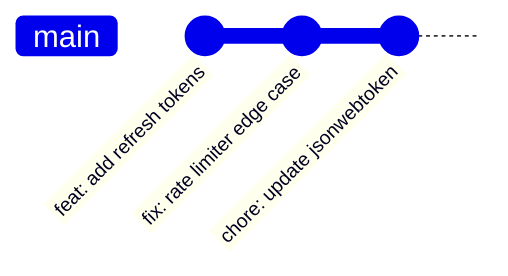
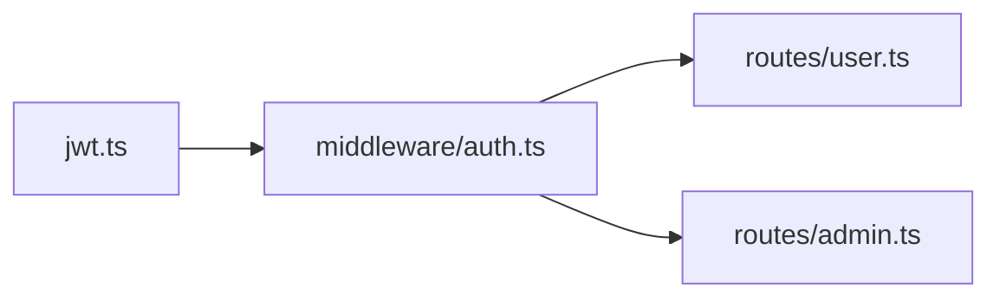

# Output Formats

DevDiff can produce changelogs in multiple formats. Choose the right format for your workflow.

---

## Specifying Format

```bash
devdiff generate --format markdown    # Default
devdiff generate --format json
devdiff generate --format mermaid
devdiff generate --format html

# Short flag
devdiff generate -f json
```

---

## Markdown (Default)

Human-readable, GitHub-compatible changelog.

```bash
devdiff generate --format markdown
# or just:
devdiff generate
```

**Example output:**

```markdown
## Changes — July 1, 2026

### ✨ Added

- `src/auth/jwt.ts` — Added refresh token support with 7-day expiry
- `src/middleware/rate-limit.ts` — New rate limiter: 100 requests/min per IP

### 🔧 Changed

- `package.json` — Updated `jsonwebtoken` 8.5.1 → 9.0.2

### 🗑️ Removed

- `src/auth/legacy-session.ts` — Removed deprecated cookie-based sessions

### ⚠️ Breaking Changes

None

### 🔒 Security Notes

- JWT library updated to patch potential timing vulnerability
```

**Save to file:**

```bash
devdiff generate --format markdown > CHANGELOG.md
devdiff generate -f markdown >> docs/CHANGES.md
```

---

## JSON

Machine-readable output, perfect for CI/CD pipelines, tools, and automation.

```bash
devdiff generate --format json
```

**Example output:**

```json
{
  "version": "1.0.6",
  "timestamp": "2026-07-01T05:00:00Z",
  "model": "llama3.2:3b",
  "persona": "developer",
  "summary": "Authentication improvements and dependency updates",
  "changes": [
    {
      "type": "feat",
      "emoji": "✨",
      "files": ["src/auth/jwt.ts"],
      "description": "Added refresh token support with 7-day expiry",
      "breaking": false,
      "security": false,
      "impact": "medium"
    },
    {
      "type": "chore",
      "emoji": "🔧",
      "files": ["package.json"],
      "description": "Updated jsonwebtoken 8.5.1 → 9.0.2",
      "breaking": false,
      "security": true,
      "impact": "low"
    }
  ],
  "stats": {
    "filesChanged": 4,
    "linesAdded": 47,
    "linesRemoved": 23,
    "breakingChanges": 0,
    "securityChanges": 1
  }
}
```

**Use in CI:**

```bash
# Extract change types for notifications
devdiff generate -f json | jq '.changes[].type'

# Check for breaking changes
BREAKING=$(devdiff generate -f json | jq '.stats.breakingChanges')
if [ "$BREAKING" -gt 0 ]; then
  echo "⚠️ Breaking changes detected!"
fi
```

---

## Mermaid Diagrams

Generates visual diagrams of your changes — architecture, git history, dependency graphs.

```bash
devdiff generate --format mermaid
```

**Example output — git timeline:**

````markdown

````

**Example output — file dependency graph:**

````markdown

````

**Render in GitHub Markdown:** Paste directly into any `.md` file — GitHub renders Mermaid automatically.

---

## HTML

Generates a standalone HTML report you can open in a browser.

```bash
devdiff generate --format html > report.html
open report.html
```

Or launch the full interactive dashboard:

```bash
devdiff report
# Opens browser at http://localhost:7654
```

---

## Combining Format + Persona

```bash
# CEO summary as clean markdown
devdiff generate --persona ceo --format markdown

# Compliance audit as JSON
devdiff generate --persona compliance --format json

# Technical diagram for architecture review
devdiff generate --persona developer --format mermaid
```

---

## Saving Output

```bash
# Overwrite
devdiff generate > CHANGELOG.md

# Append
devdiff generate >> CHANGELOG.md

# Timestamped file
devdiff generate > "changelog-$(date +%Y%m%d).md"
```

---

## Format Configuration

Set a default format in your config:

```javascript
// .devdiff.config.js
export default {
  output: {
    format: "markdown", // Default format
    file: "CHANGELOG.md", // Auto-save to file
    append: true, // Append instead of overwrite
  },
};
```
