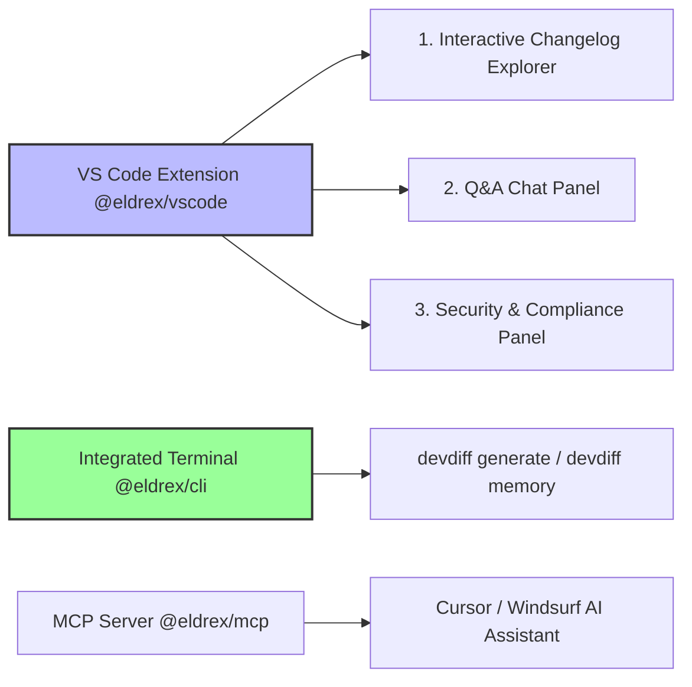

# DevDiff IDE Native Playground & Interactive Sandbox (v1.6.0)

DevDiff operates **100% natively inside your IDE**. All playground workflows — interactive diff inspection, persona switching, persistent memory Q&A, and security scans — are performed directly inside your IDE environment (VS Code extension, MCP server, and integrated terminal CLI).

---

## 🎯 Native Interactive Workflows

---

## 🚀 Key IDE Native Capabilities

1. **Interactive Persona Preview**: Switch between Developer, Product Manager, Security Auditor, Executive, and Educator personas in real time inside the VS Code sidebar.
2. **Inline CodeLens Triggers**: View and trigger `⚡ DevDiff: Explain Changes` directly above modified functions in your code editor.
3. **Sub-50ms Codebase Queries**: Ask natural language questions against persistent codebase memory directly inside your chat panel.

👉 For full setup details, see the [IDE Integration Guide](/features/ide-integration).
