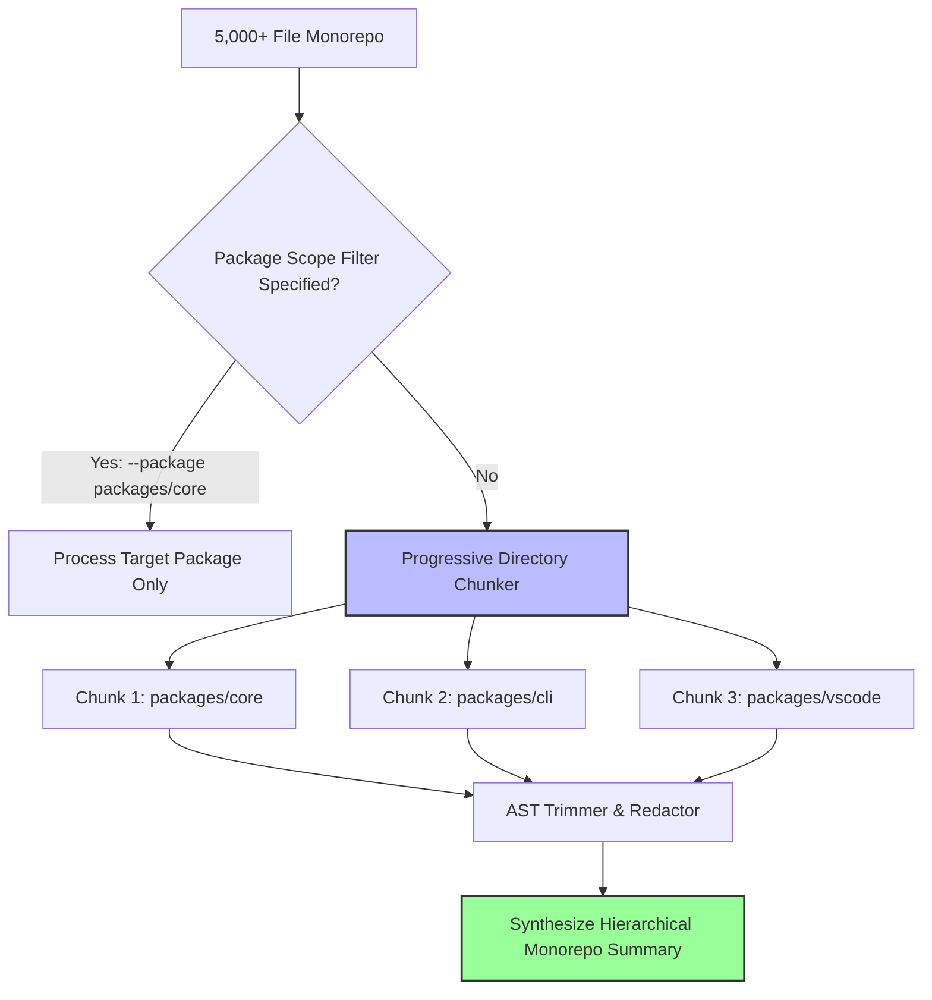

# Monorepo & Large Codebase Strategies

When operating on monorepos or repositories containing 5,000+ source files, processing diffs without strategy can trigger LLM context window overflows, memory bloat, or slow response times.

DevDiff includes built-in strategies for scaling efficiently across large repositories: **Progressive Directory Partitioning**, **AST Scope Trimming**, and **Selective Package Scope Filters**.

---

## 🎯 Scaling Architecture



---

## ⚙️ Monorepo Best Practices

### 1. Target Specific Package Scopes

Use the `--path` or `--package` flags to restrict analysis to specific sub-packages:

```bash
# Analyze changes exclusively in packages/core
devdiff generate --path packages/core

# Analyze changes in VS Code extension package
devdiff generate --path packages/vscode
```

### 2. Leverage Progressive Directory Chunking

DevDiff automatically partitions diffs larger than 100KB into directory chunks, summarizing each package independently before assembling the final changelog.

### 3. Maintain Workspace `.devdiffignore` Rules

Prevent monorepo lockfiles (`pnpm-lock.yaml`, `yarn.lock`, `bun.lockb`) from inflating diff sizes.
