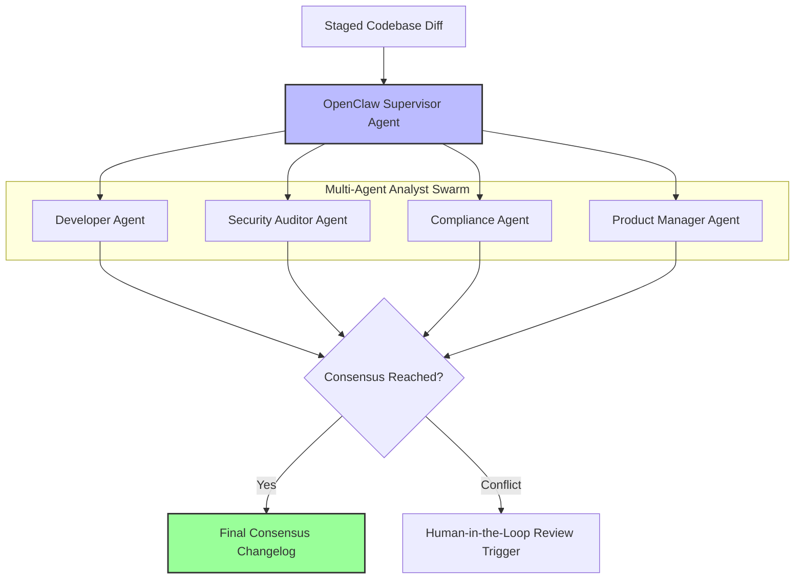

# Multi-Agent Swarm Workflows & OpenClaw Integration

DevDiff supports multi-agent swarm workflows using the OpenClaw supervisor framework ([`@eldrex/integrations/openclaw`](https://github.com/EldrexDelosReyesBula/DevDiff/tree/main/packages/integrations/openclaw)). Multi-agent mode allows specialized AI agents (Developer Agent, Security Auditor, Compliance Checker, PM) to evaluate codebase diffs concurrently and reach consensus before changelog output is finalized.

---

## 🎯 Swarm Consensus Flow



---

## 💻 CLI Multi-Agent Execution

```bash
# Run multi-agent swarm analysis
devdiff generate --swarm --agents developer,compliance,security
```
