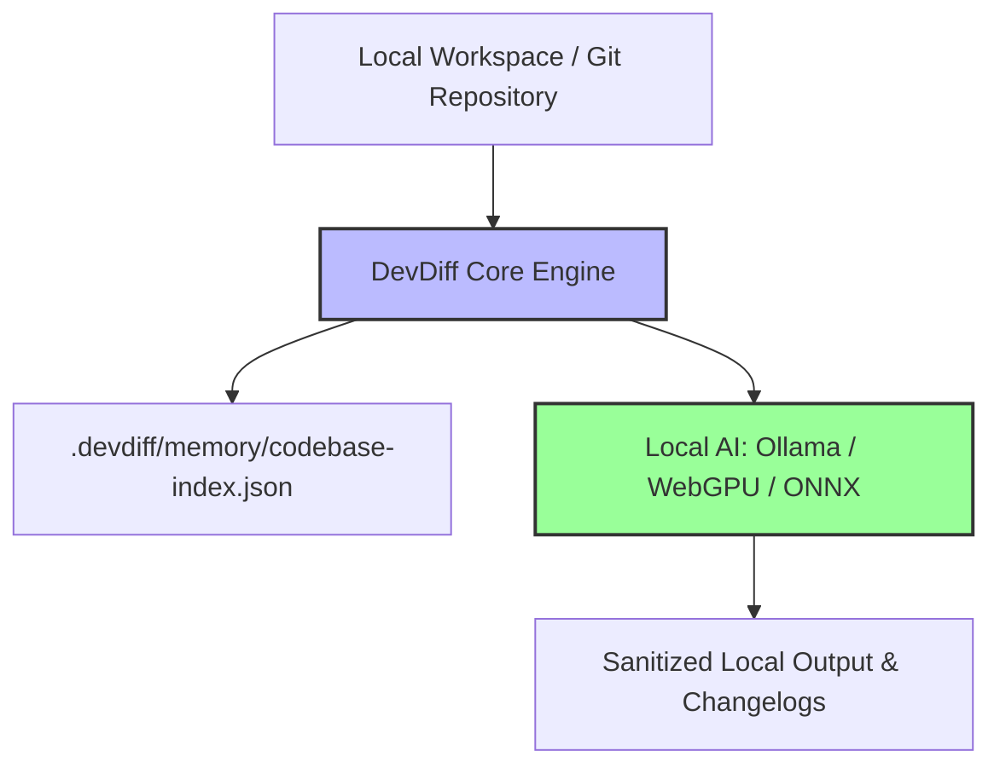

# Offline-First Architecture & Air-Gapped Workflows

DevDiff is designed from the ground up as an **Offline-First Developer Tool**. All core capabilities — diff explanations, AST dependency graphs, persistent codebase memory, changelog generation, and security compliance scans — execute 100% locally on your workstation without requiring active internet connectivity.

---

## 🎯 Offline Execution Architecture



---

## 🚀 Setting Up an Air-Gapped Workspace

### 1. Download Local Model Weights Once

On a connected machine, pull your preferred model:

```bash
ollama pull llama3.2:3b
```

### 2. Configure `.devdiff/config.json` for 100% Offline Execution

```json
{
  "network": {
    "offlineOnly": true
  },
  "ai": {
    "defaultProvider": "ollama-local",
    "providers": [
      {
        "name": "ollama-local",
        "url": "ollama://llama3.2:3b",
        "baseUrl": "http://localhost:11434"
      }
    ]
  }
}
```

### 3. Verify Offline Enforcement

Run DevDiff commands with network interfaces disabled or `STRICT_OFFLINE=1`:

```bash
STRICT_OFFLINE=1 devdiff generate
```
