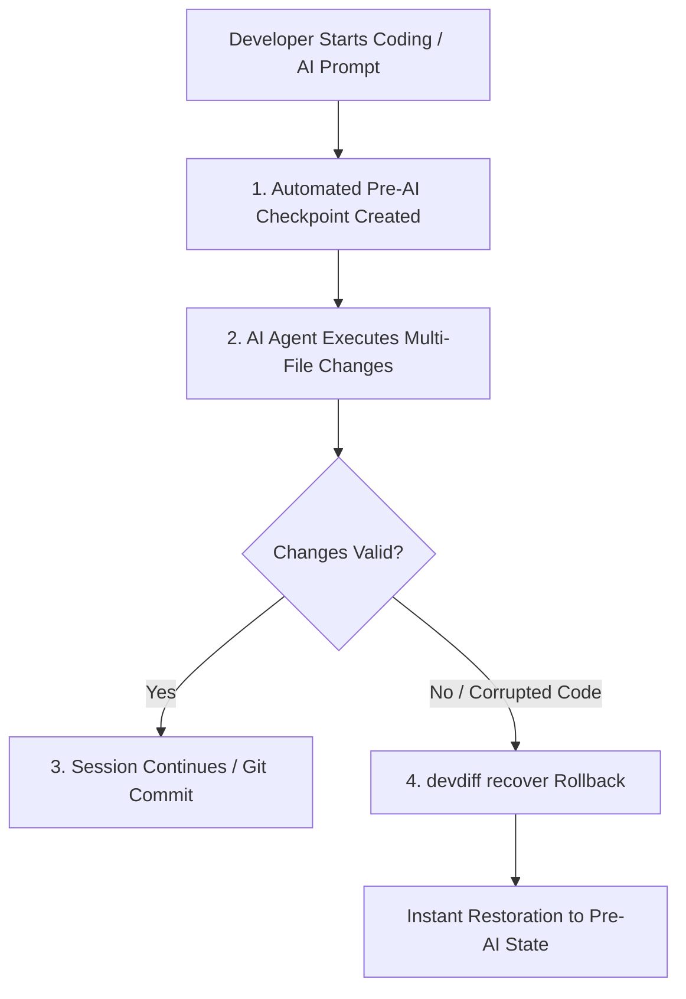

# Vibe-Coding Guardian & Zero Data Loss System

"Vibe-Coding" refers to high-speed, iterative, AI-assisted development sessions where developers pair closely with AI agents (Cursor, Windsurf, Copilot, `@devdiff`) to make rapid, multi-file code modifications. Because AI agents can occasionally hallucinate, overwrite valid code, or fail mid-execution, DevDiff includes a built-in **Vibe-Coding Guardian** to guarantee **zero data loss** and instant single-command rollback.

---

## Architecture & Safety Flow



---

## Core Safety Guarantees

### 1. Automated Pre-AI Checkpoints

- Before any AI command executes or diff analysis occurs, DevDiff automatically creates a lightweight snapshot of all staged and unstaged workspace files inside `.devdiff/memory/snapshots/`.
- Checkpoints capture exact file contents, permissions, and git status fingerprints without altering your git history.

### 2. Automatic Fallback Routing

- If a cloud AI provider experiences rate limits or network dropouts mid-session, DevDiff's AIRouter automatically fails over to your configured local Ollama model (e.g. `llama3.2:3b`) without interrupting your session.

### 3. Instant Disaster Recovery

- If an AI agent refactors a component incorrectly or deletes valid lines, you can revert your entire workspace back to any previous checkpoint in **< 1 second**.

---

## CLI Commands

### 1. Start a Vibe-Coding Session

```bash
# Initialize a vibe-coding monitoring session
devdiff vibe start
```

### 2. Inspect Active Session & Checkpoints

```bash
# View list of recent automated checkpoints
devdiff vibe status
```

Output:

```
⚡ DevDiff Vibe-Coding Guardian (Active)
Recent Checkpoints:
  [1] ckpt-1719000300-def456 (2 mins ago) — 4 files modified
  [2] ckpt-1719000120-abc123 (5 mins ago) — 2 files modified
```

### 3. Recover to a Previous Checkpoint

```bash
# Revert workspace to exact pre-AI state
devdiff recover --checkpoint ckpt-1719000300-def456
```
