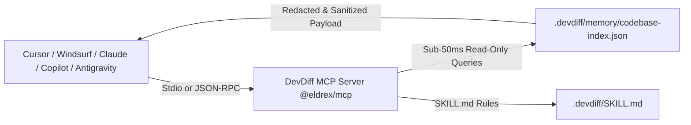

# Model Context Protocol (MCP) Server (`@eldrex/mcp`)

DevDiff includes a universal, standalone **Model Context Protocol (MCP) Server** package ([`@eldrex/mcp`](https://github.com/EldrexDelosReyesBula/DevDiff/tree/main/packages/mcp)), enabling IDE AI agents (Cursor, Windsurf, Antigravity, VS Code, Claude Desktop, Copilot, JetBrains) to query persistent codebase memory, AST dependency graphs, architecture diagrams, and change timelines with **sub-50ms latency**.

---

## Architecture & Data Flow



---

## Universal Multi-IDE 1-Click Installer

DevDiff provides an automated CLI command to auto-detect and configure MCP client settings across all popular developer environments:

```bash
# Auto-detects and installs MCP configs for VS Code, Cursor, Windsurf, Antigravity, Claude, and JetBrains
devdiff mcp install

# Check live configuration status and connection health
devdiff mcp status

# Run self-diagnostic tests against the local tool registry
devdiff mcp test

# Start the MCP server manually on stdio
devdiff mcp serve
```

---

## Manual IDE Configurations

### 1. VS Code (`.vscode/mcp.json`)

```json
{
  "mcpServers": {
    "devdiff": {
      "command": "devdiff",
      "args": ["mcp", "serve"],
      "cwd": "${workspaceFolder}"
    }
  }
}
```

### 2. Cursor (`.cursor/mcp.json`)

```json
{
  "mcpServers": {
    "devdiff": {
      "command": "devdiff",
      "args": ["mcp", "serve"],
      "cwd": "${workspaceFolder}"
    }
  }
}
```

### 3. Windsurf (`~/.codeium/windsurf/mcp_config.json`)

```json
{
  "mcpServers": {
    "devdiff": {
      "command": "devdiff",
      "args": ["mcp", "serve"],
      "cwd": "${workspaceFolder}"
    }
  }
}
```

### 4. Claude Desktop (`claude_desktop_config.json`)

```json
{
  "mcpServers": {
    "devdiff": {
      "command": "devdiff",
      "args": ["mcp", "serve"],
      "cwd": "/path/to/your/project"
    }
  }
}
```

### 5. Google Antigravity (`.gemini/antigravity-ide/mcp/devdiff/mcp.json`)

```json
{
  "mcpServers": {
    "devdiff": {
      "command": "devdiff",
      "args": ["mcp", "serve"]
    }
  }
}
```

---

## Exposed MCP Query Tools (16 Tools)

DevDiff exposes **16 dedicated, sub-50ms codebase query tools**:

| MCP Tool Name | Function & Capability | Latency |
| :--- | :--- | :--- |
| `devdiff_generate_changelog` | Generates persona-tailored changelog for staged diffs | **< 45ms** |
| `devdiff_parse_diff` | Parses git diff into structured AST additions/deletions | **< 20ms** |
| `devdiff_generate_diagram` | Generates Mermaid architecture flowchart for recent changes | **< 35ms** |
| `devdiff_security_scan` | Scans staged files for credential leaks and CVEs | **< 30ms** |
| `devdiff_query_entity` | Query entity history, methods, and parent scopes | **< 35ms** |
| `devdiff_query_changes` | Scan time-range modifications across files | **< 40ms** |
| `devdiff_query_dependencies` | Upstream and downstream module dependency graph | **< 30ms** |
| `devdiff_query_architecture` | Generate Mermaid architecture graph for module relationships | **< 45ms** |
| `devdiff_query_search` | Sub-string and AST entity search | **< 35ms** |
| `devdiff_query_compliance` | Scan staged changes against 10 compliance frameworks | **< 50ms** |
| `devdiff_query_stats` | Codebase metrics, lines changed, file counts | **< 20ms** |
| `devdiff_query_timeline` | Chronological change timeline | **< 40ms** |
| `devdiff_ask` | Multi-turn conversational Q&A against persistent memory | **< 40ms** |
| `devdiff_read_skill` | Reads and validates repository `.devdiff/SKILL.md` rules | **< 15ms** |
| `devdiff_study_explain` | Progressive code explainer across 5 skill levels | **< 35ms** |
| `devdiff_version` | Returns current DevDiff engine version and build metadata | **< 10ms** |

---

## Safety & Read-Only Guarantees

- **Read-Only**: MCP query tools only read `.devdiff/memory/codebase-index.json`. They never modify source files or trigger git commits.
- **Strict Redaction**: Secret redaction (`RedactionEngineV2`) and Unicode sanitization (`PromptSanitizer`) are automatically enforced before data returns to the client.
- **Air-Gapped Operation**: The MCP server runs 100% locally on your machine via stdio with zero network egress.
