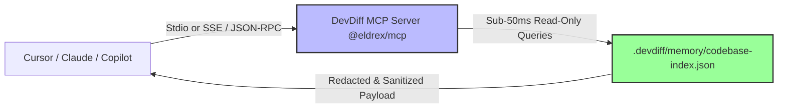

# Model Context Protocol (MCP) Server (`@eldrex/mcp`)

DevDiff includes a native **Model Context Protocol (MCP) Server** package ([`@eldrex/mcp`](https://github.com/EldrexDelosReyesBula/DevDiff/tree/main/packages/mcp)), enabling IDE AI agents (Cursor, Windsurf, Claude Desktop, Copilot) to query persistent codebase memory, AST dependency graphs, and change timelines with **sub-50ms latency**.

---

## 🎯 Architecture & Data Flow



---

## 🚀 Starting the MCP Server

Start the MCP server using the DevDiff CLI:

```bash
# Start default Stdio MCP Server (for Cursor, Windsurf, Claude Desktop)
devdiff mcp start

# Or run directly via npx
npx @eldrex/mcp start
```

---

## 💻 Cursor Integration

Add DevDiff to your Cursor MCP settings (`.cursor/mcp.json` or Cursor Settings $\rightarrow$ Features $\rightarrow$ MCP):

```json
{
  "mcpServers": {
    "devdiff": {
      "command": "npx",
      "args": ["-y", "@eldrex/mcp", "start"],
      "cwd": "${workspaceFolder}"
    }
  }
}
```

---

## 💻 Claude Desktop Integration

Add DevDiff to your Claude Desktop configuration:

```json
{
  "mcpServers": {
    "devdiff": {
      "command": "devdiff",
      "args": ["mcp", "start"],
      "cwd": "/path/to/your/project"
    }
  }
}
```

---

## 🛠️ Exposed MCP Query Tools (8 Tools)

DevDiff exposes **8 dedicated, sub-50ms codebase query tools**:

| MCP Tool Name | Function & Capability | Response Time |
|---|---|---|
| `devdiff_query_entity` | Query entity history, methods, and parent scopes | **< 35ms** |
| `devdiff_query_changes` | Scan time-range modifications across files | **< 40ms** |
| `devdiff_query_dependencies` | Upstream and downstream module dependency graph | **< 30ms** |
| `devdiff_query_architecture` | Generate Mermaid architecture graph for module relationships | **< 45ms** |
| `devdiff_query_search` | Sub-string and AST entity search | **< 35ms** |
| `devdiff_query_compliance` | Scan staged changes against 10 compliance frameworks | **< 50ms** |
| `devdiff_query_stats` | Codebase metrics, lines changed, file counts | **< 20ms** |
| `devdiff_query_timeline` | Chronological change timeline | **< 40ms** |

---

## 🛡️ Safety & Read-Only Guarantees

- **Read-Only**: MCP query tools only read `.devdiff/memory/codebase-index.json`. They never modify files or trigger git actions.
- **Rate Limited**: Default rate limit of 30 queries per minute per client connection.
- **Redacted**: Secret redaction (`RedactionEngineV2`) and Unicode sanitization (`PromptSanitizer`) are automatically enforced before data returns to the client.
