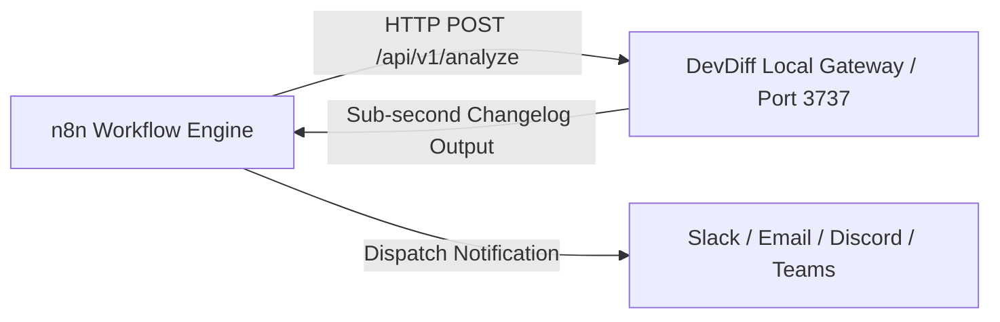

# n8n Workflow Automation Integration

DevDiff integrates with **n8n** automation workflows using HTTP Request nodes connected to the DevDiff Gateway server (`/api/v1/analyze`).

---

## Architecture & Execution Flow



---

## Setting Up n8n HTTP Request Nodes

1. Add an **HTTP Request** Node in your n8n workflow Canvas.
2. Configure Node parameters:
   - **Method**: `POST`
   - **URL**: `http://localhost:3737/api/v1/analyze`
   - **Headers**: `X-API-Key: $DEVDIFF_API_KEY` (if authentication is enabled)
   - **JSON Body Payload**:

```json
{
  "repository": "/path/to/local/repository",
  "persona": "developer",
  "format": "markdown"
}
```

3. Connect the output payload to your n8n Slack, Email, or Discord nodes to dispatch automated team updates.
