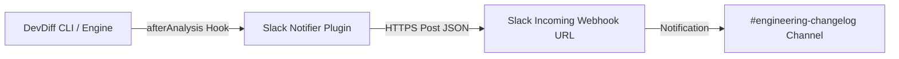

# Slack Webhook & Plugin Integration

DevDiff integrates with Slack via incoming webhooks or using the official Slack Notifier Plugin ([`examples/plugins/slack-notifier/index.ts`](https://github.com/EldrexDelosReyesBula/DevDiff/tree/main/examples/plugins/slack-notifier/index.ts)) built with `@eldrex/plugin-sdk`.

---

## Architecture



---

## Setup via Plugin SDK

```typescript
import { SlackNotifierPlugin } from "./examples/plugins/slack-notifier";

// Register in .devdiff/config.json:
{
  "plugins": [
    "./examples/plugins/slack-notifier"
  ]
}
```
