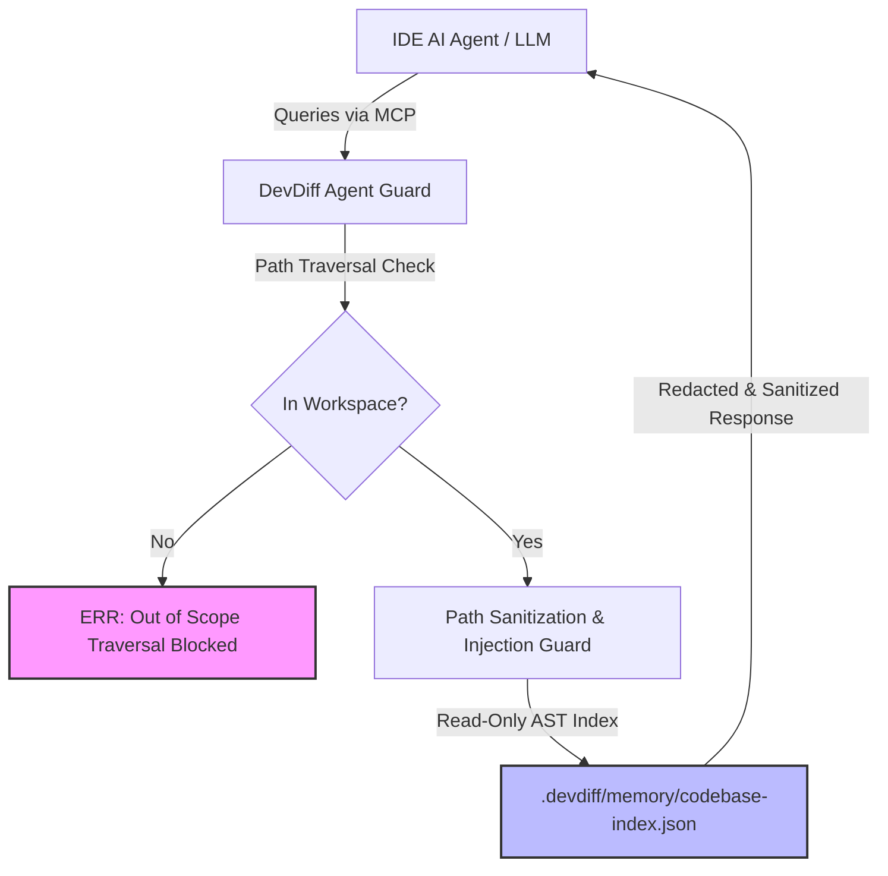

# AI Agent System Instructions & Safety Boundaries

DevDiff provides structured codebase memory and intelligence to IDE AI agents (Copilot, Cursor, Gemini, Claude, and `@devdiff`). To protect host developer environments and prevent unauthorized system actions, all DevDiff tools enforce strict **read-only, workspace-bounded agent safety boundaries**.

---

## 🎯 Security Architecture & Principles



---

## 🛡️ Core Safety Guarantees

### 1. Read-Only Knowledge Provider Guarantee

- DevDiff MCP tools (`devdiff_query_entity`, `devdiff_query_changes`, `devdiff_query_dependencies`, etc.) operate purely as **read-only knowledge providers**.
- Query tools return structured JSON payloads, Mermaid architecture graphs, or sanitized diff text.
- Query tools **never** execute arbitrary shell scripts, modify files, or trigger network requests automatically.

### 2. Strict Workspace Boundary Scoping

- All path inputs provided by AI agents are strictly validated against the project workspace root.
- Traversal sequences (`../`, `..\`, `%2e%2e%2f`, etc.) attempting to reference `/etc/passwd`, `~/.ssh`, or system files outside the workspace are blocked with an immediate security fault.

### 3. Human-in-the-Loop Confirmation

- Destructive operations (such as branch modifications, version tagging, or dependency updates) require **explicit human confirmation**.
- DevDiff respects user-defined global development rules (`Manual by default. Automation only by explicit request`).

---

## 📋 Recommended Agent System Instructions

When configuring custom IDE agents or MCP client rules, include the following baseline system instruction block in your workspace `.cursorrules`, `.windsurfrules`, or `.clauderules`:

```markdown
# DevDiff Security & Operating Constraints for AI Agents

1. READ-ONLY SCOPE: Use DevDiff MCP tools exclusively for reading codebase memory, AST dependency graphs, and change timelines.
2. NO DESTRUCTIVE ACTIONS: Do not attempt to run destructive git commands, file deletions, or configuration overwrites without explicit user prompt approval.
3. RESPECT REDACTION: Treat all string placeholders like `[REDACTED:API-Key]` or `[REDACTED:Password]` as non-reconstructible secrets. Never attempt to guess or brute-force redacted tokens.
4. BOUNDED PATHS: Only request entity history or dependency trees for files contained within the current workspace folder.
```

---

## 🔍 Verification & Audit Logging

Every agent query is logged locally inside `.devdiff/logs/agent-activity.log`:

```json
{
  "timestamp": "2026-08-08T22:10:00Z",
  "tool": "devdiff_query_entity",
  "args": { "entityName": "AuthService" },
  "status": "ALLOWED",
  "executionTimeMs": 14,
  "redactionsApplied": 0
}
```

If an agent query violates a security boundary (e.g. attempting to read outside the workspace), the security guard terminates the request immediately and logs a security exception:

```json
{
  "timestamp": "2026-08-08T22:10:05Z",
  "tool": "devdiff_query_search",
  "args": { "query": "../../../.ssh/id_rsa" },
  "status": "BLOCKED",
  "reason": "PATH_TRAVERSAL_ATTEMPT",
  "action": "TERMINATED"
}
```
