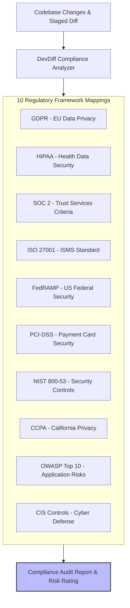

# Compliance Frameworks & Regulatory Alignment

DevDiff includes built-in compliance scanning capabilities to analyze code diffs, staged changes, and codebase memory against **10 major global compliance frameworks**.

---

## 🎯 Supported Compliance Frameworks



---

## 📋 Framework Mapping & Rule Matrix

| Framework        | Primary Focus Area          | Detection Rules & Patterns                                               |
| ---------------- | --------------------------- | ------------------------------------------------------------------------ |
| **GDPR**         | Personal Data & Privacy     | Unsanitized PII logging, unencrypted user storage, missing consent flags |
| **HIPAA**        | Protected Health Info (PHI) | Hardcoded patient identifiers, unencrypted health payload transmissions  |
| **SOC 2**        | Security & Availability     | Missing audit logs, unauthenticated routes, weak cryptography            |
| **ISO 27001**    | Information Security        | Hardcoded API keys, unvalidated inputs, missing error boundary isolation |
| **FedRAMP**      | Federal Cloud Security      | Non-FIPS cryptographic algorithms, unauthorized outbound connections     |
| **PCI-DSS**      | Cardholder Data             | Plaintext Primary Account Numbers (PAN), CVV storage in logs             |
| **NIST 800-53**  | Access Control & Integrity  | Excessive default privileges, missing session timeout parameters         |
| **CCPA**         | Consumer Privacy Rights     | Third-party data sharing endpoints without opt-out controls              |
| **OWASP Top 10** | Web App Vulnerabilities     | SQL injection, XSS, Broken Auth, SSRF, Insecure Deserialization          |
| **CIS Controls** | Inventory & Access          | Unrestricted CORS policies, weak TLS configurations, legacy dependencies |

---

## 💻 Running Compliance Scans

### CLI Compliance Scan

```bash
# Scan staged changes for GDPR & HIPAA violations
devdiff compliance scan --framework gdpr,hipaa

# Scan entire codebase memory against SOC 2 controls
devdiff compliance scan --framework soc2 --all
```

### Programmatic API Execution

```typescript
import { ComplianceEngine } from "@eldrex/core";

const report = await ComplianceEngine.scan({
  frameworks: ["gdpr", "hipaa", "soc2"],
  includeStaged: true,
});

console.log(`Found ${report.violations.length} compliance violations.`);
```
