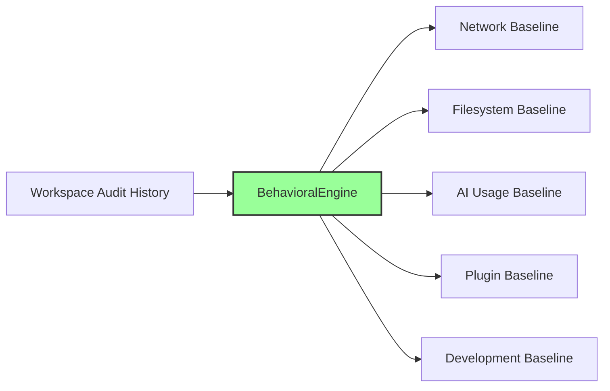

# DevDiff Dynamic Security Engine

The **DevDiff Dynamic Security Engine** represents an adaptive, learning-based protection layer introduced in DevDiff v1.7.0. While static security rules enforce strict boundaries, the Dynamic Security Engine learns your project's baseline behavioral patterns, detects real-time anomalies, ingests threat intelligence feeds, and self-tunes based on developer feedback.

---

## 🎯 Static vs Dynamic Security

```
┌─────────────────────────────────────────────────────────────┐
│              DYNAMIC SECURITY — ADAPTIVE PROTECTION           │
│                                                              │
│  Static security  = Fixed rules written once, never change.  │
│  Dynamic security = Rules that LEARN and ADAPT.              │
│                                                              │
│  • Learns your project's normal behavior patterns            │
│  • Detects anomalies in real-time                            │
│  • Adapts blocking rules based on threat intelligence        │
│  • Responds to new attack patterns automatically             │
│  • Gets smarter the longer it runs                           │
│  • Opt-in anonymized threat intelligence sharing             │
└─────────────────────────────────────────────────────────────┘
```

---

## 🧠 Behavioral Learning Engine (`BehavioralEngine`)

The `BehavioralEngine` analyzes activity over a 7-day period to establish customized baselines across 5 core dimensions:



### 1. Baselines Tracked

- **Network**: Avg daily connections, domain count, data sent (MB), common domains, and peak access hours.
- **Filesystem**: Daily files read/written, common paths, average read file size.
- **AI Usage**: Daily LLM calls, tokens per call, common personas, preferred provider, and latency.
- **Plugins**: Active plugins list and plugin-to-domain network mapping.
- **Development**: Commits per day, files per commit, peak commit hours, and daily changelog generations.

### 2. Anomaly Detection

Comparing current activity snapshots against established baselines triggers anomaly alerts when:

- **Network Traffic Spikes**: Daily connections exceed $3\times$ baseline.
- **New Domain Connections**: Contacting unrecognised domains.
- **Filesystem Anomaly**: Reading paths outside standard workspace directories.
- **AI Token Spikes**: LLM call rate exceeds $5\times$ baseline or unrecognised cloud providers are accessed.
- **Plugin Activity**: New or unverified plugins activate.
- **Development Anomaly**: Off-hours commits or commit rates exceeding $4\times$ baseline.

---

## 🛡️ Adaptive Rule Engine (`AdaptiveRuleEngine`)

The `AdaptiveRuleEngine` manages active `AdaptiveRule` definitions and incorporates real-time threat intelligence feeds:

```typescript
import { AdaptiveRuleEngine } from "@eldrex/core";

// Evaluate security context against adaptive rules
const result = AdaptiveRuleEngine.evaluate({
  domain: "api.mixpanel.com",
  category: "network",
});

if (!result.allowed) {
  console.log(`Blocked by: ${result.blockedBy.join(", ")}`);
}
```

### Feedback Loop & Self-Tuning

- **False Positive Auto-Disabling**: If a rule receives 5 false positive reports (`reportFalsePositive()`), it is automatically disabled to eliminate workflow disruption.
- **True Positive Reinforcement**: Reporting true positives (`reportTruePositive()`) increases rule confidence ratings (`low` ➔ `medium` ➔ `high`).

---

## 💻 CLI Commands

Developers can inspect and manage dynamic security directly via the CLI:

```bash
# View 7-day behavioral profile & risk score
devdiff security profile

# Run real-time anomaly check
devdiff security check

# View active adaptive security rules & accuracy metrics
devdiff security rules

# Submit feedback on a rule
devdiff security feedback rule-123 --true-positive
devdiff security feedback rule-123 --false-positive

# Manage threat intelligence feed (opt-in)
devdiff security feed --enable
```

Learn more on the official website: [https://devdiff.vercel.app/](https://devdiff.vercel.app/)
