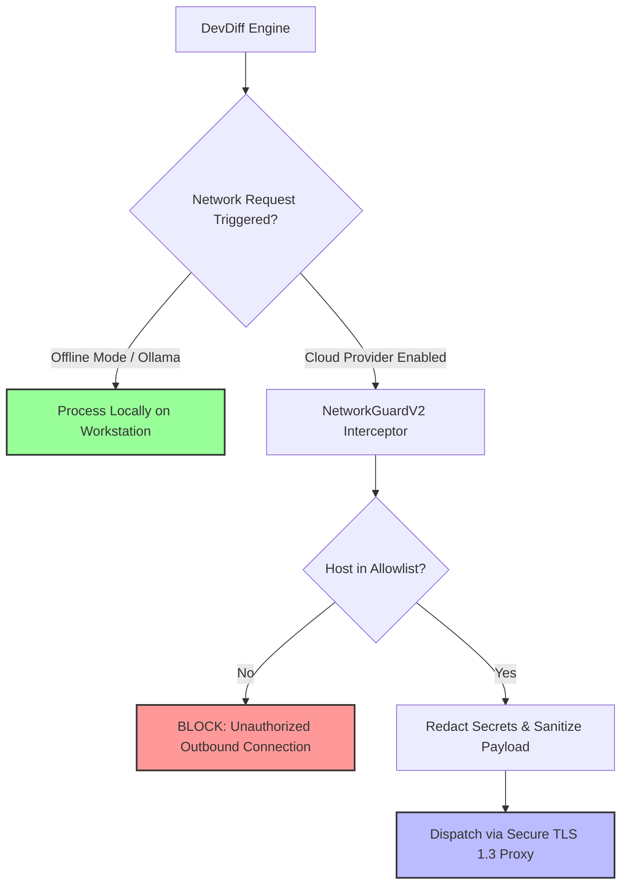

# Network Guard & Offline Mode

DevDiff is designed with a **100% Offline-First Architecture**. By default, DevDiff requires zero internet connectivity to index codebase memory, analyze AST diffs, generate changelogs, or run security scans.

When cloud-hosted AI models (OpenAI, Anthropic, Gemini) are explicitly configured, DevDiff's **Network Guard** (`NetworkGuardV2`) enforces strict host allowlists, zero-telemetry outbound filtering, and local proxy control.

---

## 🎯 Architecture & Outbound Flow



---

## 🛡️ Core Security Capabilities

### 1. 100% Offline Mode (Default)
- When paired with local Ollama models (`llama3.2`, `codellama`, `deepseek-coder`, `qwen2.5-coder`) or WebGPU, DevDiff runs **100% offline**.
- Network interfaces remain dormant; no external DNS lookups or HTTP requests are issued.

### 2. Strict Host Allowlist Enforcement
When cloud providers are enabled, `NetworkGuardV2` restricts outbound connections exclusively to verified AI endpoint domains:

- `api.openai.com` (OpenAI API)
- `api.anthropic.com` (Anthropic API)
- `generativelanguage.googleapis.com` (Google Gemini API)

Any attempt to open connections to unrecognized domains or IP addresses is blocked with a security exception.

### 3. Zero Telemetry & Tracking
- **No Analytics**: DevDiff collects **0** usage telemetry, analytics, tracking pings, or user metrics.
- **No Licensing Beacons**: Version verification and memory indexing execute locally without calling home.

### 4. Custom Enterprise Proxy Support
For enterprise corporate networks requiring outbound HTTP/HTTPS proxying, DevDiff respects standard proxy environment variables:

```bash
export HTTP_PROXY="http://proxy.internal.company.com:8080"
export HTTPS_PROXY="http://proxy.internal.company.com:8080"
export NO_PROXY="localhost,127.0.0.1"
```

---

## ⚙️ Configuration in `.devdiff/config.json`

```json
{
  "network": {
    "offlineOnly": true,
    "allowlist": [
      "api.openai.com",
      "api.anthropic.com",
      "generativelanguage.googleapis.com"
    ],
    "strictSSL": true,
    "logOutboundRequests": true
  }
}
```
