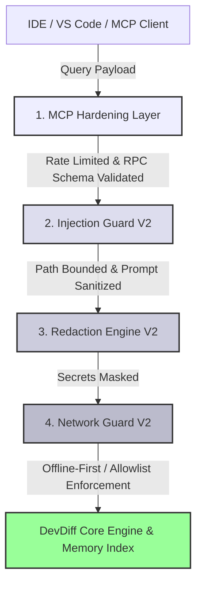

# DevDiff Security Architecture & Overview

DevDiff is engineered from the ground up as a **privacy-first, local-first, zero-telemetry developer tool**. As AI assistants integrate deeper into local software engineering workflows, protecting developer workstations, source code IP, and environment credentials is vital.

This overview outlines DevDiff's comprehensive security architecture, defense-in-depth design, and core security modules.

---

## 🎯 Defense-in-Depth Architecture

---

## 🛡️ Core Security Modules & Safeguards

| Security Module                                   | Function & Purpose                                                                                             | Primary Guide                                                |
| ------------------------------------------------- | -------------------------------------------------------------------------------------------------------------- | ------------------------------------------------------------ |
| **Secret Redaction Engine (`RedactionEngineV2`)** | Automatic scanning and masking of API keys, JWT tokens, DB URIs, and RSA keys prior to LLM/MCP dispatch.       | [Redaction Engine](./redaction-engine)                       |
| **Dynamic Security Engine (`BehavioralEngine`)**  | 7-day behavioral baseline profile creation, real-time anomaly detection, and self-tuning adaptive rules.       | [Dynamic Security](./dynamic-security)                       |
| **Injection Guard (`InjectionGuardV2`)**          | Defense against prompt injection, command injection, path traversal, SQLi, and XSS.                            | [Injection Prevention](./injection-prevention)               |
| **Unicode Sanitizer (`PromptSanitizer`)**         | Automated filtering of hidden Unicode Tag Blocks (`U+E0000..U+E007F`), zero-width spaces, and BIDI overrides.  | [Unicode Sanitization](./unicode-sanitization)               |
| **Network Guard (`NetworkGuardV2`)**              | 100% offline default mode, strict host allowlists, and zero telemetry enforcement.                             | [Network Guard](./network-guard)                             |
| **MCP Hardening (`@eldrex/mcp`)**                 | Read-only tool scoping, rate limiting (30 queries/min), and workspace jail enforcement for IDE AI agents.      | [MCP Hardening](./mcp-hardening)                             |
| **Agent Safety Boundaries**                       | Formal operating rules, read-only guarantees, and human-in-the-loop triggers for AI agents.                    | [Agent Instructions](./agent-instructions)                   |
| **Proprietary Code Safeguards**                   | AST structural abstraction and `.devdiffignore` file exclusion boundaries.                                     | [Proprietary Code Protection](./proprietary-code-protection) |
| **10 Compliance Frameworks**                      | Automated scanning against GDPR, HIPAA, SOC 2, ISO 27001, FedRAMP, PCI-DSS, NIST 800-53, CCPA, OWASP, and CIS. | [Compliance](./compliance)                                   |

---

## 🔒 The 4 Guarantees of DevDiff Security

1. **Your Code Stays Local**: Memory indexes (`.devdiff/memory/codebase-index.json`) and AST graphs run 100% locally on your workstation.
2. **Zero Telemetry**: No tracking pings, usage metrics, or analytics beacons.
3. **No Automatic Code Execution**: DevDiff tools return structured knowledge and never execute unapproved shell operations.
4. **Instant Transparency**: All indexes and logs are stored in plain, audit-ready text/JSON files inside your local repository.
