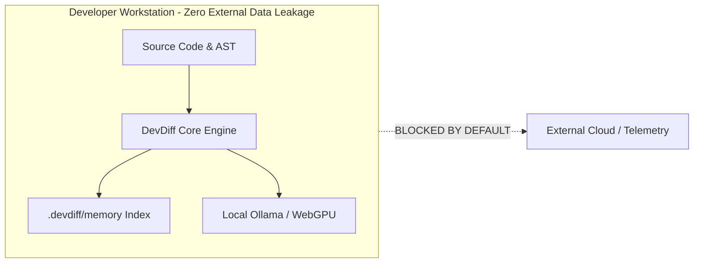

# Privacy Architecture & Data Protection

Privacy is the foundational guarantee of DevDiff. Your source code represents your core intellectual property, customer data, and competitive advantage. DevDiff is engineered so that **your code never leaves your local workstation** unless you explicitly configure a third-party AI provider.

---

## Privacy Guarantees

---

## 5 Privacy Pillars

### 1. Local-First Storage & Memory Indexing

- Codebase memory indexes (`.devdiff/memory/codebase-index.json`) are generated and stored strictly inside your local repository folder.
- Memory indexes are stored in human-readable, plain-text JSON format, allowing full transparency and auditability.

### 2. Bring Your Own AI (BYOAI) Architecture

- **You Control the Model**: DevDiff supports local Ollama models (`llama3.2`, `codellama`, `deepseek-coder`, `qwen2.5-coder`) and browser WebGPU execution.
- **Direct API Credentials**: When cloud providers (OpenAI, Anthropic, Gemini) are used, your API keys interact directly with provider endpoints. DevDiff operates no proxy servers, middleman services, or data collection hubs.

### 3. Zero Data Retention & Zero Training

- Local execution leaves **0** external data footprint.
- When cloud provider endpoints are used, DevDiff formats requests to comply with Zero Data Retention (ZDR) enterprise policies. Your code is never used to train foundation models.

### 4. Automatic Secret Redaction

- All code snippets, commit diffs, and AST entities pass through `RedactionEngineV2` prior to processing.
- API keys, credentials, private keys, and passwords are automatically masked with replacement tokens (e.g. `[REDACTED:API-Key]`).

### 5. Compliance Alignment

- **GDPR & CCPA Compliant**: Zero personal data collection, zero third-party tracking, and instant local data deletion (`devdiff memory clear`).
- **SOC 2 & ISO 27001 Ready**: Meets strict enterprise data boundary requirements.
