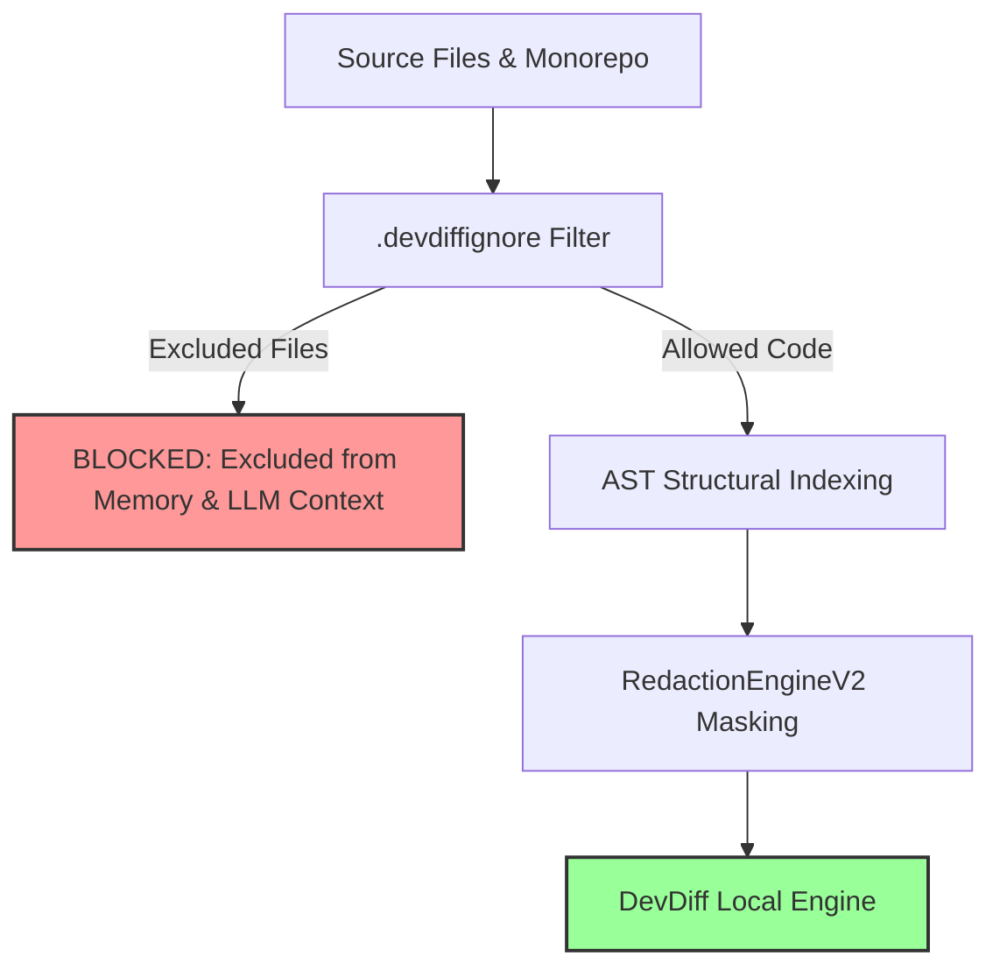

# Proprietary Code Protection & Intellectual Property Safeguards

For enterprise teams, commercial software vendors, and healthcare/financial institutions, protecting proprietary source code and preventing accidental IP disclosure is mandatory. DevDiff includes built-in **Proprietary Code Safeguards** to prevent unauthorized indexing, external transmission, or accidental leakage of sensitive codebase files.

---

## 🎯 Code Isolation Architecture



---

## 🛡️ Key Protection Features

### 1. `.devdiffignore` Exclusion Rules

DevDiff respects `.gitignore` automatically and adds support for `.devdiffignore`. Any file or pattern specified in `.devdiffignore` is strictly excluded from AST indexing, memory generation, and LLM context:

```gitignore
# Exclude proprietary core algorithms
packages/core/src/crypto/proprietary-cipher.ts

# Exclude sensitive customer data fixtures
tests/fixtures/customer-records/

# Exclude internal environment files & certs
*.env
*.pem
certs/
```

### 2. AST Structural Abstraction Mode

For extreme privacy environments, DevDiff supports **AST Abstraction Mode**. Instead of sending raw code snippets, DevDiff abstracts code into high-level AST structural signatures before LLM analysis:

```typescript
// Original Proprietary Code:
function computeProprietaryAlpha(weights: number[]): number {
  return weights.reduce((acc, w) => acc * 1.414 + w, 0);
}

// AST Abstracted Representation sent to LLM:
function computeProprietaryAlpha(param_1: number[]): number {
  // [AST ABSTRACTED LOGIC: Array transformation]
}
```

### 3. Enterprise IP Leakage Prevention

- **No Remote Repositories**: DevDiff never creates or pushes git commits, tags, or remote references without explicit developer authorization.
- **Local Index Storage**: All memory indexes reside inside `.devdiff/memory/`, keeping proprietary knowledge locked inside the local repository directory.
