# Stress Testing Suite

DevDiff undergoes comprehensive stress testing to verify correctness, memory boundaries, and execution speed under extreme repository sizes and loads.

```mermaid
gantt
    title Stress Testing Execution Flow
    dateFormat  X
    axisFormat %s
    section Core Performance
    Single File Speed (T1)       :active, 0, 1
    1000 Files Vibe Coding (T2)   :active, 1, 10
    section Scaling & Resilience
    5x Concurrent Swarms (T3)    :active, 10, 15
    5000 Files Memory Cap (T4)   :active, 15, 30
    section Edge Cases & Safety
    Binary & Symlink Handling (T5):active, 30, 35
    Injection Attack Defense (T6)  :active, 35, 40
    Secret Redaction Scan (T7)   :active, 40, 45
```



---

## 🧪 Testing Suite Overview

To run the local stress-testing suite, execute the following script from the root of the workspace:

```bash
# Set execution permissions
chmod +x test/stress/full-suite.sh

# Run the test suite under Git Bash / macOS / Linux
./test/stress/full-suite.sh
```

---

## Stress Test Reference Table

| Test ID | Name | Core Focus | Target / Pass Criteria |
| :--- | :--- | :--- | :--- |
| **T1** | Single File Change | Spawning & Parsing Overhead | Completion in `< 200ms` (Linux/Mac) |
| **T2** | 1000 Files Vibe Coding | Large Changeset Auto-Chunking | Successful fallback / progressive chunk execution |
| **T3** | Concurrent Run | Multi-Agent Swarm Concurrency | 5 parallel analyses complete without file lock collisions |
| **T4** | 5000 Files Memory Cap | Large Repository Scaling | Peak memory usage stays strictly `< 512MB` |
| **T5** | Edge Cases | File Parsing Stability | Handle binary assets, unicode names, symlinks, and empty files without crashing |
| **T6** | Script Injection | Shell & Prompt Jailbreak Guard | Block prompt injections in commits, command execution in paths |
| **T7** | Secret Leak Prevention | Redaction Accuracy | Verify secrets are redacted and never leaked to stdout/dry-runs |
