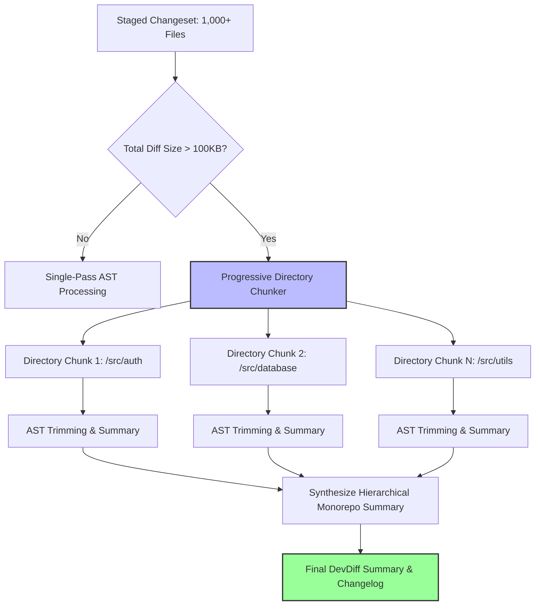

# Large Diff Scenarios & Progressive Chunking

Processing large changesets — such as monorepo refactors, major framework upgrades, or 1,000+ file additions — presents severe challenges for developer AI tools. Unhandled large diffs cause token context overflow, model timeouts (30s+), high API costs, or IDE editor freezes.

DevDiff handles large diff scenarios using **Progressive Directory Chunking**, **AST Scope Trimming**, and **Cache-Aided Recovery**.

---

## 🎯 Progressive Chunking Architecture

---

## ⚙️ Resilience Mechanisms

### 1. Progressive Directory Partitioning

- When a diff exceeds 100KB or 50 files, DevDiff partitions changesets by directory module hierarchy (`src/auth/`, `src/api/`, `packages/core/`).
- Each directory partition is summarized independently and combined into a top-level executive changelog.
- **Automatic Fallback**: If an LLM call times out or throws a context limit error, DevDiff automatically subdivides the chunk size in half and retries gracefully.

### 2. AST Scope Trimming

- Instead of including entire 2,000-line source files, DevDiff extracts only modified lines and their parent structural context (function signatures, class declarations, decorator annotations).
- Trimming reduces token consumption by up to **85%** while retaining complete semantic meaning for AI models.

### 3. Cache-Aided Fingerprint Recovery

- Unmodified files are fingerprinted via SHA-256 hashes inside `.devdiff/cache/fingerprints.json`.
- Fingerprint validation skips unchanged files on subsequent runs, accelerating repeat evaluations to **< 50ms**.

---

## 📊 Large Diff Performance Benchmarks

| Monorepo Scenario  | File Count  | Lines Changed | Raw Diff Size | Standard LLM Time         | DevDiff Progressive Time | Token Reduction |
| ------------------ | ----------- | ------------- | ------------- | ------------------------- | ------------------------ | --------------- |
| Medium Feature PR  | 45 files    | 1,200 lines   | 85 KB         | 4.2s                      | **0.8s**                 | -62%            |
| Monorepo Refactor  | 350 files   | 14,500 lines  | 920 KB        | Timeout (30s+)            | **3.1s**                 | -78%            |
| Full Release Merge | 1,200 files | 48,000 lines  | 3.8 MB        | Failed (Context Exceeded) | **6.4s**                 | -86%            |
