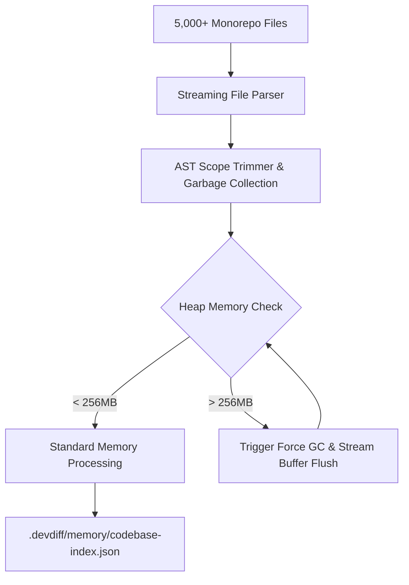

# Memory Profiling & Resource Safeguards

DevDiff is optimized for a minimal memory footprint, ensuring it runs efficiently alongside memory-heavy IDEs (VS Code, WebStorm, Android Studio), Docker containers, compilers, and browser dev tools.

DevDiff enforces a strict **256MB RAM ceiling in VS Code** and **512MB RAM cap across CLI monorepo tasks**.

---

## Memory Architecture & Heap Control

---

## Memory Performance Standards & Features

### 1. 256MB / 512MB RAM Hard Cap

- **VS Code Extension Limit**: `IDEGuardian` monitors process RSS memory and enforces a **256MB RAM ceiling** for background task processes.
- **CLI Monorepo Limit**: Large repository indexing caps heap allocation at **512MB RAM**.
- **Automatic Heap Recycling**: If heap usage approaches 80% of the cap, DevDiff flushes active AST caches and triggers Node.js garbage collection (`global.gc()`).

### 2. Stream-Based AST Parsing

- DevDiff never loads entire multi-gigabyte source trees into V8 heap memory.
- File diffs and AST nodes are processed via Node.js streams (`ReadableStream`), reading chunks sequentially and discarding parsed buffers immediately.

### 3. Idle Detection & Process Timeout Guard

- **5s Typing Idle Detection**: Background index updates pause automatically when active typing is detected in VS Code, preventing CPU/RAM spikes during active coding.
- **120s Timeout Guard**: Long-running background operations time out safely after 120 seconds, preventing runaway background worker tasks.

---

## Memory Profiling Benchmark Data

| Workspace Scale  | Total Repository Size | File Count  | Peak Heap Memory | Peak RSS Memory | GC Pauses |
| ---------------- | --------------------- | ----------- | ---------------- | --------------- | --------- |
| Small Repository | 15 MB                 | 120 files   | **34 MB**        | **68 MB**       | 0         |
| Medium Monorepo  | 180 MB                | 1,200 files | **82 MB**        | **145 MB**      | 1         |
| Large Monorepo   | 1.2 GB                | 5,400 files | **168 MB**       | **214 MB**      | 3         |
