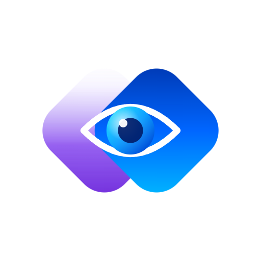

# DevDiff VS Code Extension (v1.7.0)

Privacy-first, BYOAI (Bring Your Own AI) inline codebase intelligence and changelog generation for Visual Studio Code.

<p align="center">
  
</p>

<p align="center">
  <a href="https://devdiff.vercel.app">
    
  </a>
  <a href="https://github.com/EldrexDelosReyesBula/devdiff">
    
  </a>
  <a href="https://marketplace.visualstudio.com/items?itemName=eldrex.devdiff">
    
  </a>
  <a href="https://open-vsx.org/extension/eldrex/devdiff">
    
  </a>
</p>

---

## 🔒 Privacy First

**DevDiff never sends your code anywhere.** It runs AI locally via Ollama by default. 
No telemetry. No analytics. No crash reports. [Full disclosure →](https://devdiff.vercel.app/security/disclosure)

---

## ⭐ Enjoying DevDiff?

If this extension saves you time writing changelogs, please take 30 seconds to 
**[leave a review on the VS Code Marketplace](https://marketplace.visualstudio.com/items?itemName=eldrex.devdiff&ssr=false#review-details)**.

Reviews help other developers discover DevDiff and help us prioritize features. 
Every review — even a short one — makes a difference.

**[Leave a Review →](https://marketplace.visualstudio.com/items?itemName=eldrex.devdiff&ssr=false#review-details)**

---

DevDiff explains your Git diffs, parses abstract syntax trees (AST), and maintains persistent codebase memory directly inside VS Code. It is built from the ground up for developers who care about security, privacy, and understanding what changes enter their codebase.

> 📖 **Official Documentation Portal**: Learn more about setup, configuration options, and architecture at **[devdiff.vercel.app](https://devdiff.vercel.app)**.

---

## 💬 Questions, Ideas, or Issues?

| I want to... | Go here |
|-------------|---------|
| 💡 Suggest a feature | [Feature Requests](https://github.com/EldrexDelosReyesBula/devdiff/issues/new?template=feature_request.md) |
| 🐛 Report a bug | [Bug Reports](https://github.com/EldrexDelosReyesBula/devdiff/issues/new?template=bug_report.md) |
| 💬 Ask a question | [GitHub Discussions](https://github.com/EldrexDelosReyesBula/devdiff/discussions) |
| 📖 Read the docs | [devdiff.vercel.app](https://devdiff.vercel.app) |

---

## 📦 Installation Options

### Option 1: VS Code Marketplace (Recommended)

Search for **DevDiff** in the Extensions view (`Ctrl+Shift+X` or `Cmd+Shift+X`) and click **Install**.

### Option 2: Install from Packaged VSIX

For offline development, air-gapped environments, or pre-release verification:

1. Download the packaged VSIX artifact: `devdiff-vscode-1.7.0.vsix` (available on [GitHub Releases](https://github.com/EldrexDelosReyesBula/devdiff/releases))
2. Open VS Code.
3. Open the Extensions view (`Ctrl+Shift+X` or `Cmd+Shift+X`).
4. Click the `...` (More Actions) button in the upper-right corner of the Extensions view.
5. Select **Install from VSIX...**
6. Select `devdiff-vscode-1.7.0.vsix` and click **Install**.

---

## 🚀 Key v1.7.0 Features

- 🖥️ **4 Dedicated Sidebar Views**:
  1. **Changelog Explorer**: Inspect staged changes, preview changelogs, and render inline Mermaid architecture graphs.
  2. **Q&A Chat Panel**: Ask natural language questions against persistent codebase memory in <50ms.
  3. **Security & Compliance Panel**: Run one-click vulnerability scans and check code against 10 regulatory frameworks (GDPR, SOC 2, HIPAA).
  4. **Settings & Personas Panel**: Configure active AI models, rate limits, secret redaction, and persona filters.
- 💬 **`@devdiff` Native Chat Participant**: Use `@devdiff` directly in VS Code Chat to query codebase memory and generate diff summaries.
- ⚡ **CodeLens & Gutter Annotations**: Trigger `⚡ DevDiff: Explain Changes` directly above modified functions in active text editors.
- 🛡️ **`IDEGuardian` Protection**: Isolated worker thread execution with a 256MB memory cap and 5s typing activity idle detection to ensure VS Code never freezes.
- 🔒 **Privacy-First & Local AI**: Connects out-of-the-box to local models via [Ollama](https://ollama.com) (Llama 3.2, Qwen 2.5 Coder, DeepSeek Coder) or in-browser WebGPU. No telemetry, no cloud relays.

---

## 🛠️ Usage & Commands

### 1. Initialize Workspace Memory

```bash
npx devdiff memory init
```

### 2. Command Palette Actions (`Ctrl+Shift+P` / `Cmd+Shift+P`)

- `DevDiff: Explain Staged Changes` — Generates a persona-driven changelog for staged diffs.
- `DevDiff: Send Feedback / Report Issue` — Opens the community feedback and review options menu.
- `DevDiff: Open Q&A Chat Panel` — Opens the sidebar chat interface for codebase questions.
- `DevDiff: Run Security & Compliance Scan` — Scans staged changes against regulatory standards.
- `DevDiff: Show Diagnostic Output` — Displays DevDiff extension logs.

---

## ⚙️ Configuration Settings

Customize DevDiff under **Settings** (`Ctrl+,` or `Cmd+,`) by searching for `devdiff`:

| Setting                        | Type      | Default          | Description                                                                                                     |
| ------------------------------ | --------- | ---------------- | --------------------------------------------------------------------------------------------------------------- |
| `devdiff.persona`              | `string`  | `"developer"`    | Persona perspective (`developer`, `ceo`, `educator`, `robot`, `data-analyst`, `journalist`, `pm`, `compliance`) |
| `devdiff.provider`             | `string`  | `"ollama-local"` | AI model provider (`ollama-local`, `openai-cloud`, `anthropic-cloud`, `webllm-gpu`)                             |
| `devdiff.model`                | `string`  | `"llama3.2:3b"`  | Model identifier (e.g. `llama3.2:3b`, `qwen2.5-coder:7b`, `gpt-4o-mini`)                                        |
| `devdiff.autoGenerate`         | `boolean` | `false`          | Automatically analyze changes when files are staged                                                             |
| `devdiff.showCodeLens`         | `boolean` | `true`           | Display inline `⚡ DevDiff: Explain` CodeLens annotations in editor                                             |
| `devdiff.memoryCapMb`          | `number`  | `256`            | `IDEGuardian` worker memory ceiling in megabytes                                                                |
| `devdiff.idleDetectionSeconds` | `number`  | `5`              | Pause background analysis when active typing is detected                                                        |

---

## 🔒 Security & Privacy Guarantees

DevDiff enforces strict local security sandboxing:

- **Zero Telemetry**: No tracking beacons, analytics scripts, or phone-home calls.
- **Redaction Engine v2**: Automatically strips API keys, RSA/PEM private keys, and `.env` credentials before any AI processing.
- **Network Guard**: Outbound network calls are restricted exclusively to AI provider endpoints explicitly configured by the user.

---

## 📖 Useful Links

- **Official Documentation Portal**: [devdiff.vercel.app](https://devdiff.vercel.app)
- **GitHub Repository**: [github.com/EldrexDelosReyesBula/devdiff](https://github.com/EldrexDelosReyesBula/devdiff)
- **Ollama Setup Guide**: [devdiff.vercel.app/ai-providers/ollama-setup](https://devdiff.vercel.app/ai-providers/ollama-setup)
- **Security & Privacy Policy**: [devdiff.vercel.app/legal/privacy-policy](https://devdiff.vercel.app/legal/privacy-policy)
